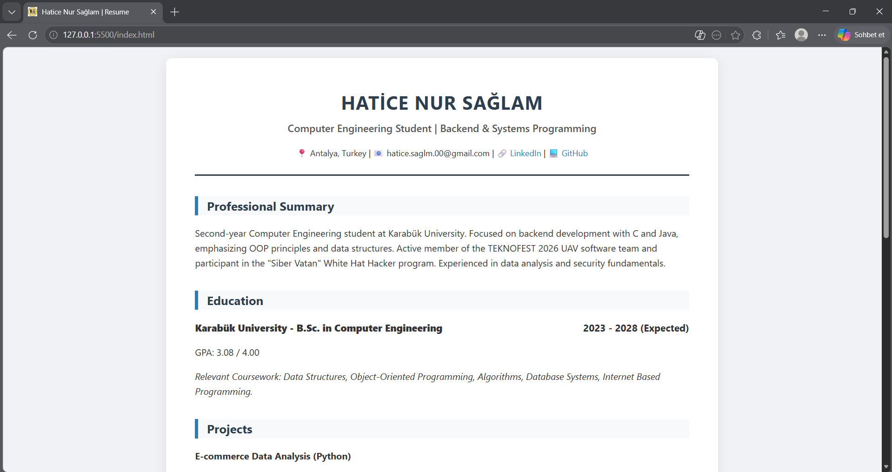
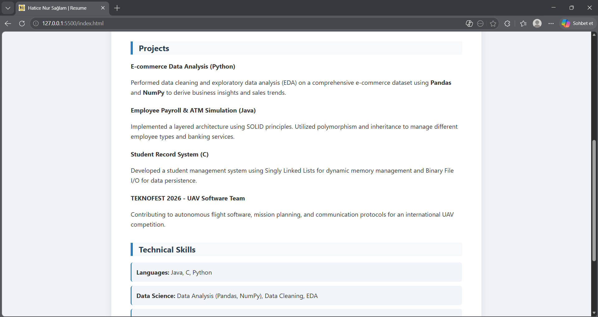
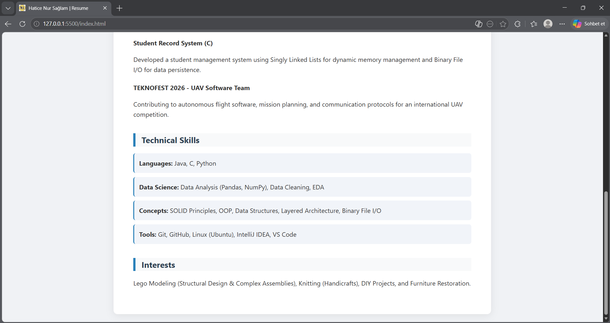

# Personal CV Website

This project is a personal resume (CV) presentation designed as a website. It was developed using HTML and CSS.

## Live Demo

You can visit the live site here: [HATİCE NUR SAĞLAM - CV]()

---

### 1. Introduction and Contact Information

This section includes basic contact information, a professional summary, and educational background.

  

---

### 2. Projects

You can find my software projects and TEKNOFEST 2026 UAV team details in this section.

  

---

### 3. Technical Skills and Interests

Programming languages, tools, core concepts I specialize in, and my personal interests.

  

---

### Project Details

* **Technologies:** HTML5, CSS3
* **Education:** Karabük University - B.Sc. in Computer Engineering
* **Project Category:** Web Development, Portfolio

## Installation and Usage

To examine the code or run it on your local machine:

1. Clone this repository: 
   `git clone REPO_LINKINI_BURAYA_YAZIN`
2. Open the `index.html` file in your browser.
